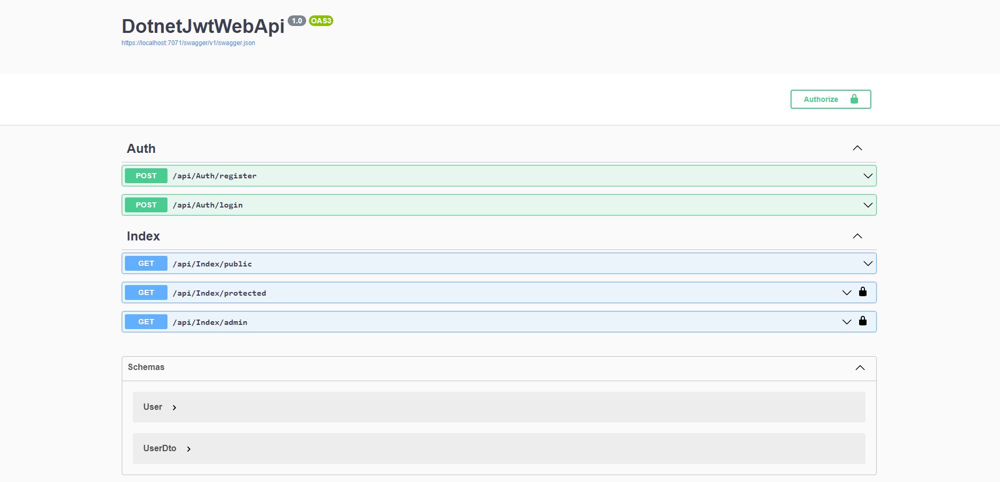

# DotnetJwtWebApi
.NET 6 Web API - Authentication &amp; Authorization (JWT) + Role based



### Installed Package
* Microsoft.AspNetCore.Authentication.JwtBearer
* Microsoft.IdentityModel.Tokens
* Swashbuckle.AspNetCore
* Swashbuckle.AspNetCore.Filters
* System.IdentityModel.Tokens.Jwt

### Get Started

1.Get: /api/Index/public
```
Anyone can visit this page no need Authorized.
```
2.Get: /api/Index/protected
```
Only Authorized user can visit this page.
```
3.Get: /api/Index/admin
```
Only Authorized and Role as "Admin" can visit this page.
```

### Authorize
```
Bearer {token}
```
